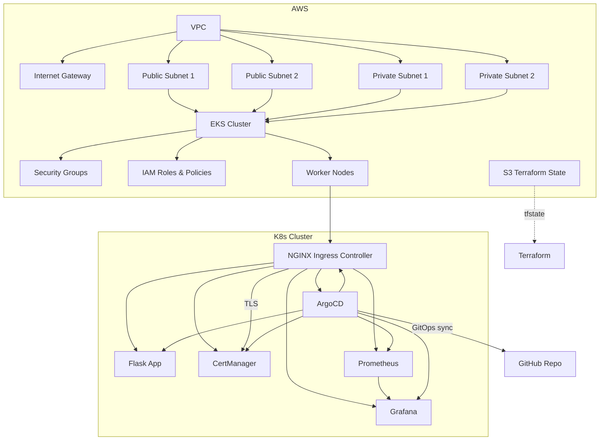

# Complete EKS Project Architecture Documentation

This project provisions a full AWS EKS-based Kubernetes environment using Terraform and Helm, and implements GitOps with ArgoCD. It includes a Python Flask application, monitoring with Prometheus and Grafana, secure ingress with NGINX, and certificate management with CertManager.

The above is all built simply from going to the GitHub Actions tab and running the pipeline (tfstate stored in s3 bucket).

To test everything has worked from my local terminal I simply run the following commands:

```
aws eks --region eu-west-2 update-kubeconfig --name flask-eks-project

kubectl get ingresses -A

curl <Ingress.Address>/health # Which should return a status code of 200 for a healthy response.
 
kubectl -n argocd get secret argocd-initial-admin-secret -o jsonpath="{.data.password}" | base64 -d #If you want to use argocd
```

---

## **Architecture Overview**



---

## **Component Breakdown**

### **AWS Infrastructure**
- **VPC**: Isolated network for all resources.
- **Subnets**: Public and private subnets for high availability.
- **EKS Cluster**: Managed Kubernetes control plane.
- **Worker Nodes**: EC2 instances running Kubernetes workloads.
- **Security Groups**: Control traffic to nodes and services.
- **IAM Roles**: Fine-grained permissions for EKS, nodes, and service accounts.
- **S3**: Stores Terraform state for CI/CD.

### **Traffic Flow (NGINX Ingress Controller)**
- All external traffic enters via the NGINX Ingress Controller (provisioned by Helm).
- NGINX routes traffic to services (Flask app, ArgoCD UI, Grafana, Prometheus, etc.) based on ingress rules.
- TLS termination is handled by CertManager and NGINX.

### **Certificate Management (CertManager)**
- CertManager automates the creation and renewal of TLS certificates for Ingress resources.
- Certificates are used by NGINX for secure HTTPS traffic.

### **ArgoCD GitOps Flow**
- ArgoCD is deployed via Helm and manages application deployments declaratively.
- It continuously syncs the cluster state with the GitHub repository (`complete-eks-project`).
- Any changes to manifests or Helm charts in the repo are automatically applied to the cluster.

### **Monitoring (Prometheus & Grafana)**
- **Prometheus**: Collects metrics from the cluster and workloads.
- **Grafana**: Visualizes metrics and dashboards, accessible via NGINX Ingress.
- Both are deployed and managed via Helm and can be accessed securely through the Ingress controller.

---

## **Traffic Flow Example**
1. User accesses the application via the ELB DNS (provisioned by NGINX Ingress).
2. NGINX Ingress routes `/` to the Flask app, `/grafana` to Grafana, `/argocd` to ArgoCD, etc.
3. CertManager ensures all ingress endpoints have valid TLS certificates.
4. Prometheus scrapes metrics, and Grafana provides dashboards at `/grafana`.
5. ArgoCD UI is available at `/argocd` for GitOps management.

---

## **GitOps Workflow**
- Developers push changes to the GitHub repo.
- GitHub Actions runs Terraform to update infrastructure.
- ArgoCD detects changes and syncs Kubernetes resources automatically.

---

## **Accessing Components**
- **Flask App**: `http(s)://<elb-dns>/`
- **Grafana**: `http(s)://<elb-dns>/grafana`
- **ArgoCD**: `http(s)://<elb-dns>/argocd`
- **Prometheus**: `http(s)://<elb-dns>/prometheus` (if exposed)

---

## **Security**
- All access is secured via AWS IAM, Security Groups, and TLS certificates.
- No static AWS credentials are stored in the repo; GitHub Actions uses OIDC to assume roles securely.

---

## **Diagram Legend**
- **Solid arrows**: Direct traffic or resource relationships
- **Dashed arrows**: CI/CD or GitOps automation

---

For more details, see the Terraform and Helm module files in this repository.